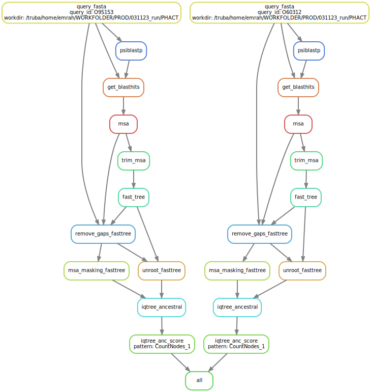

# PHACT
PHACT, **PH**ylogeny-**A**ware **C**omputation of **T**olerance (for amino acid substitutions), is a computational framework based on Snakemake workflow to predict the functional effects of missense mutations. 

The proposed approach exploits the phylogenetic tree information to measure the deleteriousness of a given variant. Basically, the workflow is designed by considering not only amino acid frequency, also evolutionary relationship between species, physicochemical properties of amino acids and dependence and independence of substitutions. 


*The workflow of PHACT for given queries as an example to predict the effect of missense mutations.*

# First time setup
The following steps are required to run PHACT workflow
1. Install conda & snakemake without super user right permission
	- Install [miniconda](https://conda.io/projects/conda/en/latest/user-guide/install/linux.html#install-linux-silent), a package management system
	- Install [snakemake](https://snakemake.readthedocs.io/en/stable/getting_started/installation.html), a workflow management system using mamba
	- Compile and install [PAML](http://abacus.gene.ucl.ac.uk/software/paml.html) into a specific PATH, for example, `~/resources/paml4.9j`  
2. Configuration of workflow (see below)
3. Set model parameters (see below)
4. Check PHACT workflow  (see below)

## Genetic database

## Configuration
The configuration file *(config/config.yml)*, a dictionary of configuration parameters and their values, is prepared to make the workflow more flexible. The following global parameters should be set as following.
- **workdir** indicates the working directory. After cloning the repository, the full path, for example, `/home/emrah/PHACT`, should be set properly.
- **qeury_fasta** is a list of query files in fasta format, for example, `["O95153", "O60312"]`  that workflow will analyze.
- **archived_path**, an optional parameter, to store all output for completed analyses into specified folder if proper bash script available in the repository is used.  

Meanwhile, which tools and versions are used during the performing task are defined a set of environment yaml files available under `workflow/envs` folder. Each file has prepared for conda package manager to install and setup environment based on definition.

## Model parameters
PHACT framework is based on a snakemake workflow, which is defined by specifying rules in Snakefile (`workflow/Snakefile`). Rules decompose the workflow into small steps such as finding homologues of each query sequence (PSI-BLAST), performing multiple sequence alignment (MAFFT) or generating a maximum-likelihood phylogenetic tree (RAXML-NG, FASTTREE). 

Each rule has its own model parameters which can be set via single configuration file (`config/config.yml`). For example, the selected method for multiple sequence alignment is set as following.
```
#alignment
mafft_method: "-fftns" #if left empty it will be FFT-NS-2
```

## Test workflow
To check if the workflow is defined properly and to estimate the amount of calculation remaining, dry-run parameter is used as following.
```
$ cd workflow
$ snakemake --dry-run
```
It basically summarizes the number of total job (rule) performed, and sets of input and output files used and created respectively. For given 2 query files in this example, 29 jobs will be executed as they are listed below.
```
Job counts:
        count   jobs
        1       all
        2       fast_tree
        2       get_blasthits
        2       iqtree_anc_score
        2       iqtree_ancestral
        2       ml_tree
        2       msa
        2       psiblastp
        2       query_fasta
        2       raxml_anc_score
        2       raxmlng_ancestral
        2       remove_gaps
        2       trim_msa
        2       unroot_fasttree
        2       unroot_tree
        29
```

# Running PHACT workflow
The simplest way to run PHACT workflow in a local computer is as following.

1. Clone the PHACT repository and cd into it.
`$ git clone https://github.com/CompGenomeLab/PHACT.git`
`$ cd PHACT`
2. Modify **workdir** and **query_files** parameters  in `config/config.yml` to be path the working directory and query id's
`$ pwd` (gives the working directory)
3. Prepare the environment for snakemake
`$ conda activate snakemake`
4. Run the workflow and follow the executed rules during analyses
`snakemake -j 1 --use-conda`

## PHACT output
The outputs will be in a subfolder of results with their query_id prefix. Each query id folder has its own blast, multiple sequence alignment, maximum likelihood phylogenetic tree, ancestral sequence reconstruction and their computing score. The result/query_id directory will have the following structure:
```
.
├── 1_psiblast
├── 2_msa
├── 3_mltree
├── 4_raxmlng_ancestral
├── 5_raxmlng_ancestral_scores
├── 6_fasttree
├── 7_iqtree_ancestral
└── 8_iqtree_ancestral_scores
8 directories
```


## Scaling the pipeline across a HPC (farm)
In addition to allow workload running on a local computer with limited number of query id's, PHACT framework is designed to analyze a bulk of query id's in a parallel way using High Performance Computing center.

Most HPC clusters has a scheduler that handles which workload are run on which compute nodes. To interact with a scheduler, users typically need to prepare a bash script and then submit it to cluster. Snakemake has a functionality to perform all these efforts automatically. 

PHACT framework, based on Snakemake, has a number of profile files prepared for SLURM scheduler which is mostly used nowadays. The slurm profile files (`config/slurm_truba` or `config/slurm_sabanci`) indicate the fundamental definitions for executing workflow on HPC with Slurm. 

Running snakemake with `snakemake --profile config/slurm_truba` would be enough to search the directory and load the profile file that can be used at any time.

## Tips and tricks for running workflow 
- **Caching between workflow** is very useful property that Snakemake provides. To avoid redundant computation between workflow, it is recommended to use cache as following. Although, the implementation should be considered experimental.
`$ export SNAKEMAKE_OUTPUT_CACHE=<THE_PATH_OUTPUT_WILL_BE_CACHED>`
`$ snakemake --use-conda --cache --profile ../config/slurm_truba`
- **Monitoring** the execution via web url is possible if a panoptes server is installed and configured properly. Running snakemake with `--wms-monitor http://ephesus.sabanciuniv.edu:5000` parameter is neccessary.
- Use `--keep-going` parameter is recommended to proceed running independent jobs in case of any failure on a task.
- The `screen` command or execute the snakemake in background are useful for long set of runs in workflow in order to avoid any troubles in case of connection lost to the user interface or terminal

# Distribution and reproducibility
We provide a template for a reproducible and scalable research project using Snakemake and various programming language (python, R) and tools managed by conda package manager. Set of rules is constructed to implement the entire research pipeline starting from genetic databases with querying the homologues, aligning sequences, trimming MSA, generating the phylogenetic tree, ancestral reconstruction and then calculate the score. 

To get the same results after running workflow regardless to the platform (local computer, HPC, cloud computing), the framework should have the same set of input files, the version of software/tools. Since all requirement is well defined explicitly, it's possible to get the same results.

# Citing this work
Kuru, N., Dereli, O., Akkoyun, E., Bircan, A., Tastan, O., & Adebali, O. (2022). PHACT: Phylogeny-aware computing of tolerance for missense mutations. Molecular Biology and Evolution. https://doi.org/10.1093/molbev/msac114

# Data availability
All data obtained during this study is shared on the following url. 
https://phact.sabanciuniv.edu/pubs/kuru_mbe_2022/

* Please see Publications/Kuru_etal_2022 folder to reproduce the figures in PHACT manuscript.

# Acknowledgement
This work was supported by the Health Institutes of Turkey (TUSEB) (Project no: 4587 to O.A.) and EMBO Installation Grant (Project no: 4163 to O.A.) funded by the Scientific and Technological Research Council of Turkey (TÜBİTAK). Most of the numerical calculations reported in this paper were performed at the High Performance and Grid Computing Center (TRUBA resources) of TÜBITAK. The TOSUN cluster at Sabanci University was also used for computational analyses. We also want to thank Nehircan Özdemir for his art illustration of the PHACT approach.
